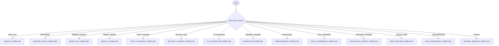

# Usage Guide

## Template Selection Flowchart



## Step 1: Choose the Closest Template

| Folder | When to use |
|--------|-------------|
| `templates/master/` | Broad sessions, or when nothing else fits closely |
| `templates/workflows/` | Common engineering tasks: bug fix, feature build, refactor, CI, docs, review, research |
| `templates/custom/` | Repeated high-value work: repo credibility, CLI builds, AI workflows, OSS positioning, CI hardening, proof of method |
| `templates/builders/` | When no existing template fits and you need to create a new one |

Do not force a template that does not match. If the work is genuinely new, use the Template Builder to create a purpose-built one.

## Step 2: Fill Only What Matters

Do not stuff the prompt with everything you know. Include only the context that materially changes the work.

**Good context:**
- The exact task (not the project history)
- Key constraints that the model would not know from the code alone
- Specific files or modules the work touches
- Validation requirements (what "done" looks like)

**Bad context:**
- Long backstory unrelated to the current task
- Broad speculation about future work
- Restating information that is already in the repo's README or CLAUDE.md
- Pasting entire files when only a section matters

Rule of thumb: if removing a piece of context would not change the model's output, remove it.

## Step 3: Point the Model at the Repo

Name specific files, directories, or modules. Do not make the model guess the codebase structure.

```md
## Likely Relevant Files
- src/pipeline/router.py (routing logic that needs the new path)
- tests/test_router.py (existing tests to extend)
- pyproject.toml (if entry point changes are needed)
```

If you do not know which files are relevant, say so explicitly and ask the model to identify them as a first step.

## Step 4: Require Structured Output

Always define what the model should deliver. A good default:

1. Summary of what changed and why
2. Files created or modified
3. Assumptions made (anything the model decided without being told)
4. Risks or tradeoffs (what could break, what was left unaddressed)
5. Validation performed (tests run, lint clean, manual checks)
6. Follow-up recommendations (if any)

This is not bureaucracy. It is how you catch mistakes before they compound.

## Step 5: Save Repeated Patterns as New Templates

If a session pattern shows up more than once, it should become a custom template. Use the Template Builder (`templates/builders/TEMPLATE_BUILDER.md`) or the Work-Specific Template Prompt (`templates/builders/WORK_SPECIFIC_TEMPLATE_PROMPT.md`) to create it.

That is how this stops being "prompting" and starts being infrastructure.

## Common Workflow Examples

### Bug fix
1. Copy `templates/workflows/BUGFIX_TEMPLATE.md`
2. Fill in: problem, expected vs. actual behavior, suspected area, severity
3. Point at the relevant module and test file
4. Require: root cause, fix, test coverage, residual risk

### Feature build
1. Copy `templates/workflows/FEATURE_BUILD_TEMPLATE.md`
2. Fill in: feature purpose, requirements, existing patterns to follow
3. Point at the module where the feature belongs
4. Require: implementation, tests, docs update if needed

### Interview prep (repo review)
1. Copy `templates/custom/REPO_CREDIBILITY_TEMPLATE.md`
2. Fill in: repo link, audience (recruiter / interviewer / engineer), review goal
3. Require: 30-second impression, strengths, weaknesses, top fixes, positioning language

### New template creation
1. Copy `templates/builders/WORK_SPECIFIC_TEMPLATE_PROMPT.md`
2. Fill in: work type, repo context, typical tasks, common failures
3. Require: a complete, copy-paste-ready template in a markdown code block
4. Review the output, refine, and save to `templates/custom/`
